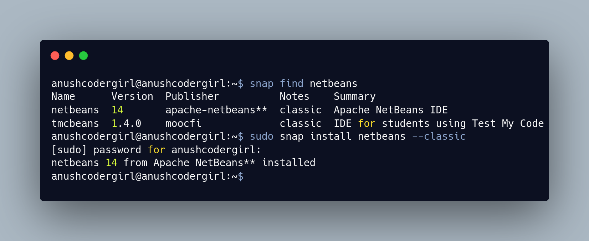
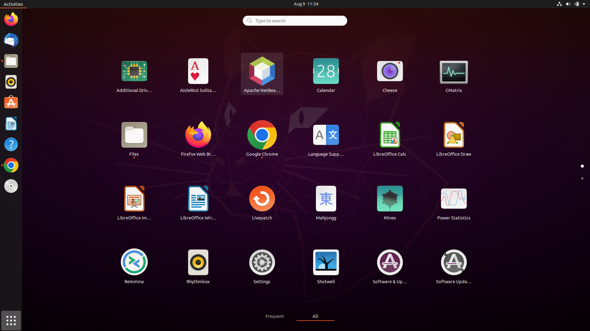

# Apache NetBeans Installation


## 📌 Overview
This guide explains how to install **Apache NetBeans IDE** on Ubuntu using different methods.

- Recommended: Snap (easy & quick)
- Alternative: Manual installation (latest version)
- Optional: APT (older version)

## ⚙️ Prerequisites
- Ubuntu system (18.04 or later recommended)
- Internet connection
- Basic terminal knowledge

---

### Method 1: Install via Snap (Recommended)
Snap is the easiest way to install NetBeans.

#### Step 1: Install NetBeans
```bash
sudo snap install netbeans --classic
```

### Step 2: Launch Netbeans
```bash
netbeans
```

#### ✅ Advantages
Simple installation
Automatic updates
#### ❌ Disadvantages
Slightly slower startup

---

### Method 2: Manual Installation (Latest Version)
#### Step 1: Install Java (JDK)
#### Step 2: Download NetBeans
Visit the official website:
https://netbeans.apache.org/download/
Or download via terminal:
```bash
wget https://downloads.apache.org/netbeans/netbeans/20/netbeans-20-bin.zip
```
#### Step 3: Extract the Archive
```bash
unzip netbeans-20-bin.zip
```
#### Step 4: Run NetBeans
```bash
cd netbeans-20/bin
./netbeans
```
### Method 3: Install via APT
```bash
sudo apt install netbeans
```
#### ⚠️ Note
This installs an older version from Ubuntu repositories.


## 📚 References
Apache NetBeans Official Site: https://netbeans.apache.org/